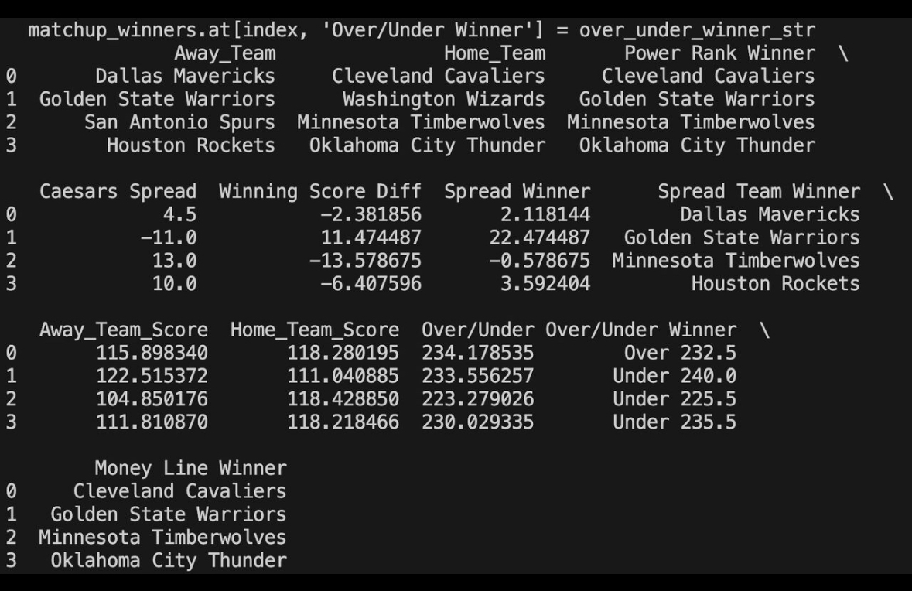
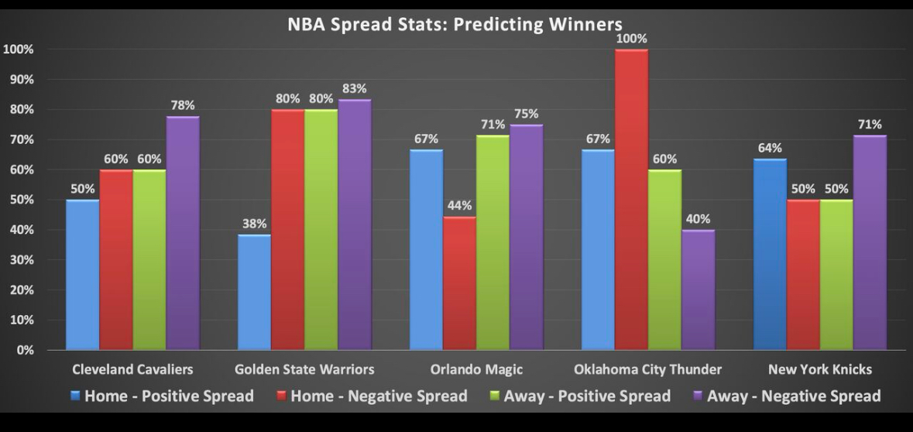
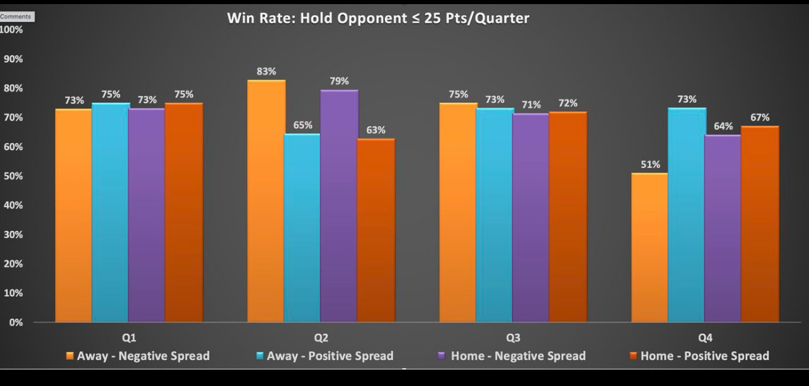

# nba-four-factor-modeling

Python-based NBA analytics tool using Dean Oliver’s Four Factors, matchup-adjusted stats, and predictive models. Includes player/team data scraping, Excel modeling, weighted scoring formulas, and backtesting to explore game outcomes and efficiency trends.

 **In Progress:** This is an ongoing personal project I'm actively improving in my free time w/ [@Yeswanth1649](https://github.com/Yeswanth1649) . New metrics, modeling logic, and backtesting features are added regularly as I explore more ways to understand and predict NBA matchups.

###🏀📚 Historical Foundation: Dean Oliver’s Four Factors

This project draws inspiration from **Dean Oliver**, the pioneer of modern basketball analytics and author of *Basketball on Paper*. His groundbreaking **Four Factors of Basketball Success** — eFG%, TOV%, ORB%, and FTR — remain the foundation for evaluating team efficiency in the NBA. Oliver’s weighted model (40/25/20/15) forms the basis of this project’s adjusted scoring formulas and matchup-based predictions.

## 📁 Files Included

| File Name                                 | Description |
|------------------------------------------|-------------|
| `NBA_Player_Stats_2024_2025_Season.xlsx` | Auto-generated output file from the Python script. Updates after each run with the latest player/team stats from Basketball Reference. |
| `NBA_Player_Stats.xlsx`                  | Interactive Excel dashboard with weighted Four Factor scores, adjusted stats, matchup analysis, and predictive models. |
| `NBA_Player_Stats.py`                    | Scraper script using `requests`, `BeautifulSoup`, and `pandas` to extract and clean NBA player/team data and export it to Excel. |

## ⚙️ How It Works

1. **Run `NBA_Player_Stats.py`** – Pulls player and team stats from Basketball Reference and saves them into the season Excel file.
2. **Excel Modeling** – Uses dynamic formulas to:
   - Calculate and weight Four Factor stats across Season, Last 20/10/5 games.
   - Create matchup-adjusted performance metrics.
   - Apply scoring formulas for projected spreads and game outcomes.
3. **Backtesting** – Compares predicted metrics to real results to analyze correlation and improve accuracy.

## 📌 Key Concepts

- **Four Factors:** eFG%, TOV%, ORB%, FTR — calculated and compared across teams and opponents.
- **Matchup Adjustments:** Stats are scaled using opponent allowed values and league averages.
- **Predictive Modeling:** Combines Four Factors, 3P metrics, and team ratings to estimate spreads, totals, and win probabilities.
- **Rolling History:** Stats updated and analyzed based on last 5, 10, and 20 games to reflect momentum and regression.

---
## 📸 Project Visualizations

### Matchup Prediction Output

### Spread Prediction Accuracy

### Defensive Quarter Win Rate

---
**Run this project daily or weekly to stay current with NBA trends and improve prediction accuracy.**

